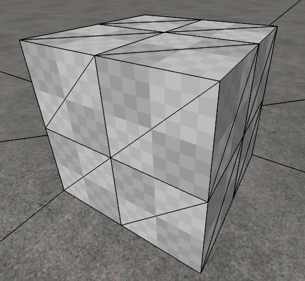
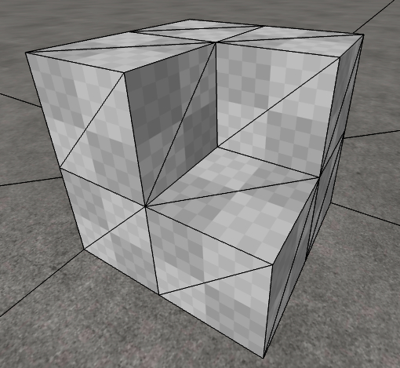
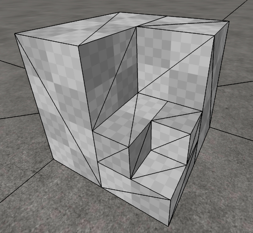
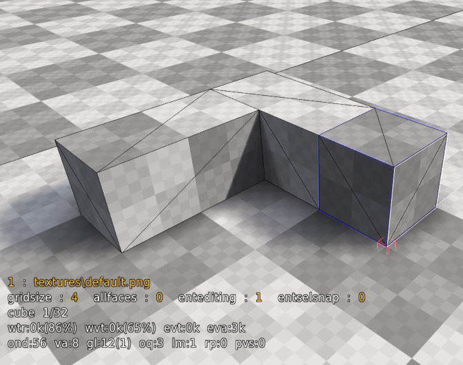
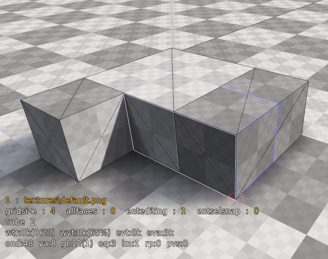
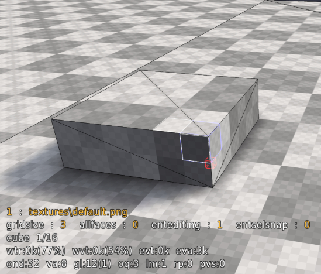
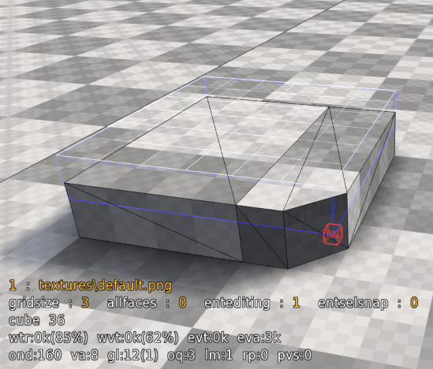
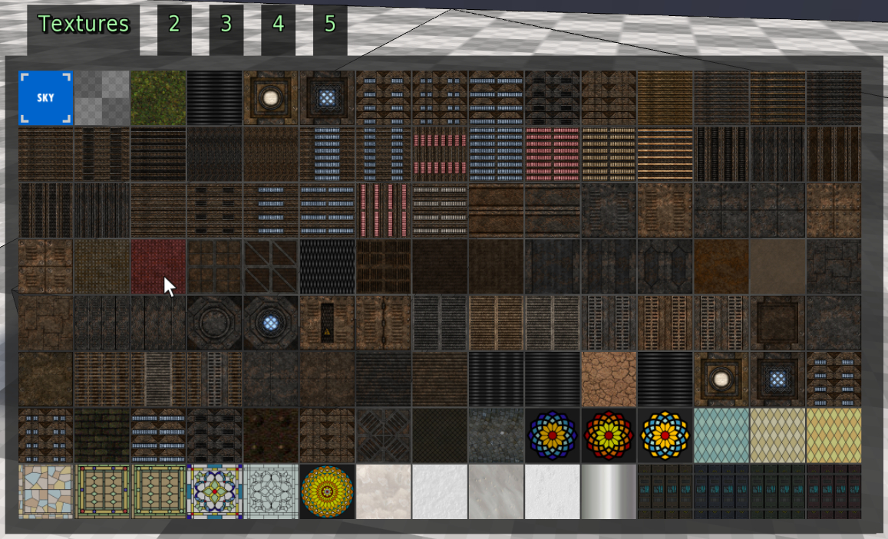
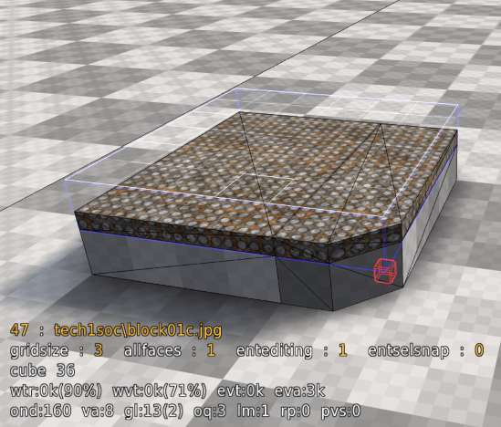

# Map Editing

## Editing In Cube 2

Editing is done within the program itself, and the structure of the map is comprised of octrees. Octree may sound confusing but it's actually a pretty simple idea. Imagine a cube you can do two things to: push the corners at any angle inwards, or split the cube into 8 smaller cubes (4 cubes in the top half, 4 cubes in the bottom half) which you can do the same things to. That's all there is to it! Below is an example cube where it is split and one cube is removed, and then again for a smaller cube.

  

With that out of the way: fire up the game and press E. This is edit mode. The first thing you'll notice is a faded outline of the face of the cube pointed to by your cross hair. If you click on this face it will be selected, and will be outlined by a solid outline. You can click and drag to select multiple faces of cubes. When you have cubes selected, all editing commands will go to those cubes, otherwise it will go to the cube face you are pointing at. Also notice the blue sparklies in the map. These are entities. They control things such as ammo, player spawns, lights, etc. In the bottom left above your health you'll find text stating what is the currently selected texture and the status of common editing commands. This changes depending on the selection context.

## The basics

Go into edit mode (E), press T and type `/newmap 11`. This command creates a blank map, where smaller numbers create smaller maps and larger numbers create larger maps (min 10 and max 16). Editing commands are performed on the cube you selected by clicking and dragging, or the face you are pointing at if none are selected. Point at the ground near you and roll the mouse wheel towards you. This creates a new cube towards you. If you want a cube floating in the middle of the air, you can hold the right mouse button (MOUSE2) while aiming at the selection to move it. Pushing the mouse wheel forward deletes the cube.

### Practicing

Either by selecting faces or just pointing at them try to create a structure like an upside down L.

Now select the two inner cubes with the right mouse button (MOUSE2) and rotate the scroll towards you.

 

Fill in the remaining space to create a square

Now try holding G (gridpower) and move the mouse wheel towards you once. The selection size is now one step smaller. Any space you alter at this grid size will be made up of smaller cubes, which will take more time to render but allow finer detail. The finest grid size is much smaller than this, and the max size much much larger. Try to select the top right corner of the square face facing you.

Now, let's edit those corners. To select corners press and hold Middle Mouse Button, much the same as selecting with the Left Mouse Button. Try playing with the mouse wheel.

After filling the entire right edge of the cube with the corner selection, rotate the mouse wheel to push or pull the selected corners.

It may seem confusing the first time, but with practice you will get the idea. The same effect can be achieved in a "slower" way by aiming to a corner, holding Q and rotating the mouse scroll.

Now to flatten all selected faces, select the top left corner of the square with the left mouse button and the bottom right corner with the right mouse button.

Hold F and scroll with mouse. This edits all corners at once. These operations may seem simple but they allow for the creation of complex geometry.

To apply a new texture to the selected area, press the F2 button, `Tomatenquark` already has some textures and mapmodels (F4) by default.

Select the desired texture and you're done.

The rest is a matter of creativity and practice!

By now you should have an idea of how most editing operations work.
Some shortcuts can be used to customize the selected area, such as Y to open the recent texture menu or I and O to scroll the selected texture.
Another useful command is rotate, which is done with R and the scroll wheel. Experiment with these operations to get a feel for them and then save your creation with the command `/savemap mmapname` where mapname is some name of your choosing. This will create a file in packages/base named mapname.ogz. Save your work often! Backups of old saves will be made for you with a .BAK extension. You can later open your map with the command /map mapname.

## Entities

Entities all have a blue particles sparkling to indicate their position. Some entities such as ammo boxes and armor will also show their standard in-game model. Monsters, doors or triggers will only render in single player mode. Make sure you're familiar with the different [types on entities](/game/EDITREF?id=entity-types). To add an entity select it from the editing section of the built in menu or type `/newent entname arg1 arg2 arg3 arg4` such as `/newent light 32 120 120 120`. The location of the entity will be at your selection by default. This behavior can be changed through the `entdrop` variable, but the default is best in most cases. You can delete an entity with the delent command, which is bound to your del key.

For a DM: Place some "playerstart" entities, suggested quite a few of them, i.e. from 5 or so in a really small map up to 15 in really big ones. Place some ammo... remember to not just place excessive amounts: ammo spawns VERY quickly (4 to 8 seconds depending on player load), and not having endless ammo forces the player to move around the map more and use different weapons, rather than just using the one she is most effective with all the time. Normal health items... suggested from 3 or 4 for a really small map to 8 or more in really big ones. The items "boost", "yellow armour", "greenarmour" and "quaddamage" all suggested 1 item, or maybe multiple green armours or boosts in bigger maps. Add some teleports sparingly, only if they really make sense for connectivity and gameplay.

## Lighting

See the [lighting commands](/game/EDITREF?id=lighting) for an indepth list of all lighting related commands.

## Materials

There are various materials available such as water, lava & clip etc. To create a material make a selection then in the console type /water. The area of your selection will have the material applied to it.

**Hint**: You do not have to type the full command you can just type the name of the material. For example /water rather then /editmat water.

See [available materials](/game/EDITREF?id=editmat).

## Cheat Sheet

- Mouse Left Button: Select Faces
- Mouse Middle Button: Select Corners
- Mouse Right Button: Extend selection; Reorient section direction (requires initial selection)
- Mouse Wheel: Pull cubes into existence and push them out of existence
- Spacebar: Deselect
- F+Mouse Wheel: Push and pull all 4 corners at once (in the case of no corner selection)
- R+Mouse Wheel: Rotate relative to the white box
- Y+Mouse Wheel: Quick texture change
- G+Mouse Wheel: change grid size
- U: undo one step
- X: Mirror relative to the side of the white box
- F2: Texture menu
- Keypad Enter: Selection entities within selection
- /savemap mapname to save your map
